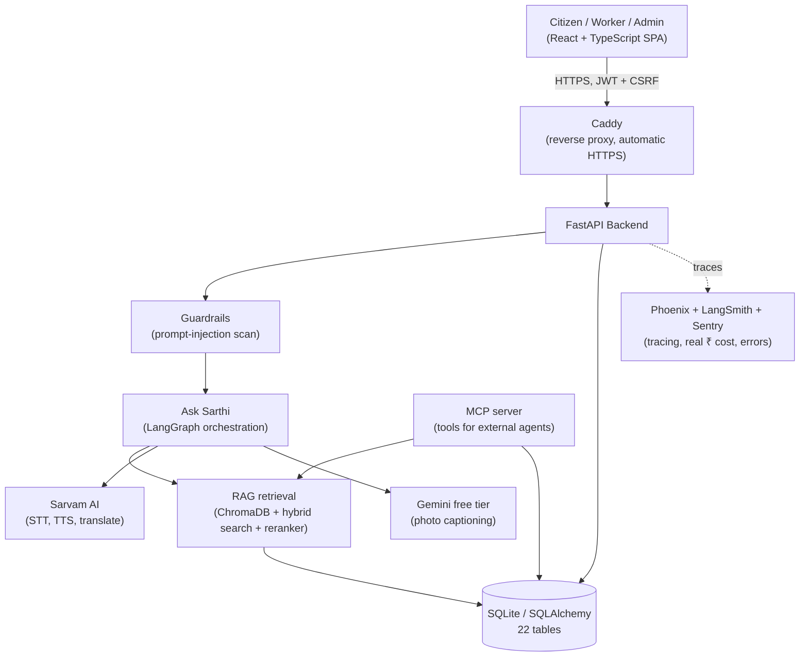
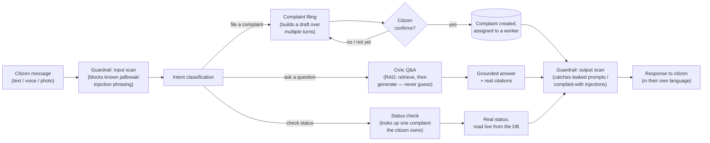

# JanSarthi AI

**🔴 Live: [jansarthi-ai.duckdns.org](https://jansarthi-ai.duckdns.org)** — a real, deployed production app, not a local-only demo.

A multilingual civic-grievance platform for India. A citizen reports a problem (garbage, water/drainage, roads/potholes, streetlights) or asks a civic question — by speaking, typing, or attaching a photo, in any of 6 Indian languages — through **Ask Sarthi**, a single conversational AI agent. The complaint is translated, routed to the real municipal worker who covers that ward, tracked to resolution, and rated. The AI agent, the security model, and the deployment pipeline are all production-grade, not a prototype shortcut.

**Why it matters:** in India, most civic apps assume the citizen and the worker share a language, and most "AI features" bolted onto apps like this are a thin wrapper that just calls an LLM and hopes. This one doesn't assume either.

## 📚 Full documentation

This README is a quick reference and setup guide. Full depth — written so it makes sense whether or not you already write code, detailed enough to explain confidently in an interview — lives in `docs/`.

| If you want to understand... | Read this |
|---|---|
| The big picture: what this app is, how its pieces fit together | **[`docs/PROJECT_OVERVIEW.md`](docs/PROJECT_OVERVIEW.md)** |
| **Ask Sarthi**: the LangGraph agent, intent classification, stateless orchestration | **[`docs/ask_janmitra_orchestration.md`](docs/ask_janmitra_orchestration.md)** |
| **RAG**: retrieval, embeddings, hybrid search, the cross-encoder reranker, VERIFIED/SYNTHETIC knowledge tiers | **[`docs/ask_janmitra_rag_architecture.md`](docs/ask_janmitra_rag_architecture.md)** |
| How a citizen's message actually flows end to end, turn by turn | **[`docs/ask_janmitra_service_flow.md`](docs/ask_janmitra_service_flow.md)** |
| The backend: FastAPI, why it was chosen, how routes/services/models are layered | **[`docs/BACKEND.md`](docs/BACKEND.md)** |
| The frontend: React, component structure, state management, routing | **[`docs/FRONTEND.md`](docs/FRONTEND.md)** |
| The database: SQLAlchemy, the real 22-table schema, why SQLite (and its real limits) | **[`docs/DATABASE.md`](docs/DATABASE.md)** |
| Login, JWTs, roles, httpOnly cookies, and CSRF | **[`docs/AUTHENTICATION.md`](docs/AUTHENTICATION.md)** |
| Rate limiting: the 4 independent sliding-window limiters | **[`docs/RATE_LIMITING.md`](docs/RATE_LIMITING.md)** |
| The original complaint-filing AI pipeline (STT/normalize/translate/summarize) | **[`docs/AI_AGENT.md`](docs/AI_AGENT.md)** |
| Testing strategy: pytest, mocking, Playwright end-to-end tests | **[`docs/TESTING.md`](docs/TESTING.md)** |
| Tracing (LangSmith + Phoenix), real ₹ cost tracking, Admin AI Monitoring | **[`docs/ask_janmitra_langsmith_observability.md`](docs/ask_janmitra_langsmith_observability.md)** + **[`docs/OBSERVABILITY.md`](docs/OBSERVABILITY.md)** |
| Error monitoring (Sentry): concepts, then technical reference | **[`docs/ERROR_MONITORING_GUIDE.md`](docs/ERROR_MONITORING_GUIDE.md)** + **[`docs/ERROR_MONITORING.md`](docs/ERROR_MONITORING.md)** |
| CI/CD and the live production deployment (GCP) | **[`docs/DEPLOYMENT_GCP.md`](docs/DEPLOYMENT_GCP.md)** |
| What's deliberately out of scope so far | **[`future_work.md`](future_work.md)** |

Historical/superseded docs (kept for context, not current-state reference) live in **[`docs/archive/`](docs/archive/)**.

## Current status

Full citizen/worker/Admin roles with JWT access+refresh tokens (httpOnly cookies + CSRF double-submit protection), role-based access control, mandatory OTP email verification, and 4 independent rate limiters. Ward-scoped complaint assignment with automatic reassignment on rejection (every ward has 2+ workers for exactly this reason). Voice complaints aren't capped at Sarvam's 30-second-per-request limit (recordings are chunked client-side and stitched back together). The UI supports 6 languages: English, Hindi, Marathi, Odia, Gujarati, Bengali.

**Ask Sarthi**, the AI assistant, is a stateless [LangGraph](https://langchain-ai.github.io/langgraph/) orchestration — not a single prompt-and-hope call. It classifies intent, then routes to complaint-filing, RAG-grounded civic Q&A, or complaint-status-check, converging on a shared response node. Every AI request passes through hand-rolled prompt-injection guardrails (`backend/services/guardrails.py`) before and after the model call. The RAG layer combines vector search (ChromaDB + `multilingual-e5-small` embeddings), hybrid BM25+vector search, and an optional cross-encoder reranker (`ms-marco-MiniLM-L-6-v2`) over a real, sourced knowledge base — VERIFIED records carry a real government citation; SYNTHETIC_REPRESENTATIVE records are honestly labelled as such. If nothing clears the relevance threshold, it says "I don't have reliable information" instead of guessing. The same services are also exposed as [MCP](https://modelcontextprotocol.io) tools (`backend/mcp_server.py`) for any MCP-compatible client.

This replaced an earlier, simpler version (hardcoded single citizen/worker, no login, Streamlit-only frontend) — those Streamlit apps (`frontend/citizen_app.py`, `frontend/worker_app.py`) still exist in this repo for reference but are fully superseded by the React frontend below.

## Architecture



Full diagrams + explanation: [`docs/ask_janmitra_orchestration.md`](docs/ask_janmitra_orchestration.md) (the agent graph), [`docs/ask_janmitra_rag_architecture.md`](docs/ask_janmitra_rag_architecture.md) (retrieval), [`docs/PROJECT_OVERVIEW.md`](docs/PROJECT_OVERVIEW.md) (everything else, including the complaint lifecycle).

### How one message actually flows through Ask Sarthi



Nothing is ever filed without an explicit "yes," and no civic answer is ever given without a real, retrieved source — the two places this app is most deliberately careful about trust.

## Tech Stack

- **Frontend:** React 19 + TypeScript (Vite), React Router 7, plain hand-written CSS (no framework) with light/dark theming, Sentry for error tracking — `frontend-react/`
- **Backend:** FastAPI (Python), SQLAlchemy ORM over SQLite (Postgres-ready)
- **AI orchestration:** [LangGraph](https://langchain-ai.github.io/langgraph/) — Ask Sarthi's whole conversation is a stateless directed graph of nodes, not nested if/else
- **RAG:** ChromaDB (vector store) + `intfloat/multilingual-e5-small` embeddings + hybrid BM25/vector search + an optional cross-encoder reranker (`cross-encoder/ms-marco-MiniLM-L-6-v2`)
- **AI safety:** hand-rolled prompt-injection guardrails on every request's input and the model's output
- **Language AI:** Sarvam AI — speech-to-text, text-to-speech, and translation, tuned for Indian languages
- **Vision:** Google Gemini's free tier for photo captioning
- **Tool exposure:** an [MCP](https://modelcontextprotocol.io) server wrapping RAG/complaint services as tools for any MCP-compatible client
- **Auth & security:** JWT access + refresh tokens, httpOnly cookies, CSRF double-submit protection, role-based access control, bcrypt, 4 independent sliding-window rate limiters
- **Observability:** Arize Phoenix + LangSmith (LLM tracing, real ₹ cost per model) + Sentry (errors, performance)
- **Infrastructure:** Docker + Docker Compose, Caddy (reverse proxy/automatic HTTPS), deployed on a Google Cloud Compute Engine VM
- **CI/CD:** GitHub Actions — a CI workflow (pytest + npm build/lint) that must pass before a separate CD workflow builds Docker images, pushes to GHCR, and deploys over SSH
- **Testing:** 1000+ pytest tests (backend, AI calls mocked) + Playwright (end-to-end) + Hypothesis (property-based)
- **Legacy:** `frontend/citizen_app.py` / `worker_app.py` — the original Streamlit frontend, superseded by `frontend-react/`, kept for reference

## Project Structure

```
janmitra-ai/
├── backend/
│   ├── config.py                    # All settings, loaded from .env
│   ├── main.py                      # FastAPI app entry point
│   ├── middleware.py                # CSRF double-submit-cookie middleware
│   ├── models.py                    # 22 tables — users, complaints, location hierarchy, ...
│   ├── database.py                  # Engine/session setup, init_db()
│   ├── deps.py                      # Auth (JWT/cookie), require_role(), rate-limit dependencies
│   ├── mcp_server.py                 # Exposes RAG/complaint services as MCP tools
│   ├── routes/
│   │   ├── auth.py                  # Signup, login, refresh, email OTP, password reset
│   │   ├── admin.py                 # Worker management, AI monitoring, complaint oversight
│   │   ├── complaints.py            # Full complaint lifecycle + PDF reports
│   │   ├── locations.py             # State/City/Ward/Area cascade, GPS reverse-geocode
│   │   ├── notifications.py         # Per-user notification feed
│   │   └── ask_janmitra.py          # Ask Sarthi: text/image/voice entry points
│   └── services/
│       ├── orchestration/           # graph.py, nodes.py, state.py — the LangGraph agent
│       ├── observability/           # tracing.py — Phoenix/LangSmith spans
│       ├── ask_janmitra_service.py  # Wires the graph together, guardrails at the edges
│       ├── rag_retriever.py         # Vector + hybrid search, reranking
│       ├── reranker.py              # Cross-encoder reranker
│       ├── vector_store.py / embedding_provider.py
│       ├── guardrails.py            # Prompt-injection input/output scanning
│       ├── intent_classifier.py     # Complaint / Q&A / status-check routing
│       ├── location_extractor.py / location_resolver.py
│       ├── complaint_agent.py       # STT→normalize→translate→summarize pipeline
│       ├── assignment_service.py    # Ward-scoped worker assignment + reassignment
│       ├── rate_limiter.py          # Hand-rolled sliding-window limiter
│       ├── auth_service.py          # Password hashing + JWT issuing/verification
│       ├── complaint_report_service.py  # PDF resolution reports
│       ├── vision_service.py        # Gemini photo captioning
│       └── sarvam_client.py         # STT/TTS/translate, direct Sarvam SDK calls
├── frontend-react/
│   ├── src/pages/                   # 21 screens — one file per page
│   ├── src/components/              # 36+ reusable UI pieces
│   ├── src/lib/                     # API client, auth, i18n, audio recording, theming
│   └── e2e/                         # Playwright end-to-end tests
├── frontend/                        # Legacy Streamlit apps (superseded, kept for reference)
├── prompts/                         # AI prompt text, never hardcoded in Python
├── scripts/                         # Admin/seed/migration/RAG-build scripts
├── docs/                            # Full documentation — see the table above
├── data/rag_knowledge_base/         # VERIFIED/SYNTHETIC knowledge records (source of the RAG index)
├── uploads/                         # Stored complaint/evidence photos
├── tests/                           # pytest (1000+ tests, AI calls mocked)
├── .github/workflows/               # CI (test/build) + CD (build images, deploy over SSH)
├── docker-compose.prod.yml
├── setup.ps1                        # One-command local setup (Windows)
├── requirements.txt
└── .env.example
```

## Setup

**Fastest path (Windows, PowerShell):** clone the repo, then run `.\setup.ps1` from the project
root. It creates a real isolated virtual environment for the backend (`.venv/`), installs the
frontend's npm packages, and sets up Phoenix's own separate environment (`.phoenix-venv/` — kept
separate on purpose, see [`docs/OBSERVABILITY.md §2`](docs/OBSERVABILITY.md#2-two-python-environments-on-purpose--dont-merge-them)
for why merging it in would actually break things). Safe to re-run. Skip to step 3 below to
configure `.env` once it finishes.

The manual steps it automates, if you'd rather do them yourself or aren't on Windows:

1. **Clone and install backend dependencies**

   ```bash
   git clone https://github.com/sumya24/janmitra-ai
   cd janmitra-ai
   python -m venv .venv
   .venv\Scripts\activate        # Windows; on macOS/Linux: source .venv/bin/activate
   pip install -r requirements.txt
   ```

2. **Install frontend dependencies**

   ```bash
   cd frontend-react
   npm install
   cd ..
   ```

3. **Configure environment variables**

   ```bash
   cp .env.example .env
   ```

   The most important variables to set — see `.env.example` for the full, current list (it covers 40+ variables: rate limits, Sentry, Phoenix, RAG tuning, and more):

   | Variable | Description |
   |---|---|
   | `SARVAM_API_KEY` | Your Sarvam AI subscription key (STT, TTS, translation) |
   | `LLM_API_KEY` | Key used for chat-completion calls. Leave blank to reuse `SARVAM_API_KEY` |
   | `LLM_MODEL` | Chat model used (defaults to `sarvam-105b`) |
   | `JWT_SECRET_KEY` | Secret used to sign tokens. **Set this explicitly for any real deployment** — if left blank, a random key is generated per process, invalidating every session on restart |
   | `DATABASE_URL` | SQLite connection string |
   | `RAG_RERANKER_ENABLED` | Turn the cross-encoder reranker on/off (default: off, opt-in) |
   | `RAG_HYBRID_SEARCH_ENABLED` | Turn hybrid BM25+vector search on/off (default: on) |
   | `SENTRY_DSN` | Enables error/performance monitoring if set |
   | `PHOENIX_TRACING` | Enables LLM tracing to a local/self-hosted Phoenix instance |

   Get a Sarvam AI API key at [sarvam.ai](https://www.sarvam.ai/).

4. **Build the RAG knowledge base** (required before the backend can start — `chunks.json` isn't committed to git)

   ```bash
   python scripts/build_rag_knowledge_base.py
   python scripts/build_rag_embeddings.py
   ```

5. **Seed the first Admin account**

   ```bash
   python scripts/seed_admin.py
   ```

   This is the *only* way an Admin account ever gets created — there's no sign-up path for it. Safe to re-run; it checks for an existing account with the same phone number first.

6. **Run the backend**

   ```bash
   python -m uvicorn backend.main:app --reload
   ```

   API docs available at `http://localhost:8000/docs`.

7. **Run the frontend** (in a separate terminal)

   ```bash
   cd frontend-react
   npm run dev
   ```

   Open `http://localhost:5173`.

## Demo Workflow

1. Open the app, pick a UI language, and sign up as a citizen (phone + password, OTP-verified email).
2. Log in as the Admin you seeded, and create a worker account for a specific ward.
3. Log back in as the citizen. Open **Ask Sarthi** and either file a complaint conversationally (e.g. "कचरा उचलला नाही" — "Garbage has not been collected") or ask a civic question directly ("who do I contact for garbage collection in Ahmedabad?").
4. If filing a complaint: Ask Sarthi asks for anything missing, shows a summary, and only files it once you explicitly confirm. It's immediately assigned to the worker you created in that ward.
5. Log in as that worker, see the complaint (translated into their own preferred language), and **Accept** it.
6. Post a progress update, then mark it **Resolved** with a completion photo.
7. Log back in as the citizen — the complaint shows **Resolved** with a real photo/status timeline, and a 1-5★ feedback form appears.
8. Log back in as the Admin — see the complaint in **AI Monitoring** with its real trace, latency, and ₹ cost.

## API Endpoints

The real surface is large (40+ routes across 6 modules) — this is a representative slice; see each route file directly for the rest, or `http://localhost:8000/docs` for the live, auto-generated reference.

| Method | Endpoint | Who | Description |
|---|---|---|---|
| `POST` | `/auth/signup` | Anyone | Create a citizen account (requires OTP-verified email) |
| `POST` | `/auth/login` | Anyone | Log in with phone or email + password |
| `POST` | `/auth/refresh` | Anyone (valid refresh token) | Exchange a refresh token for a new access token |
| `POST` | `/ask-janmitra` | Citizen | Ask Sarthi — text: file a complaint, ask a civic question, or check status |
| `POST` | `/ask-janmitra/voice` | Citizen | Same, from a voice recording (chunked if long) |
| `POST` | `/ask-janmitra/image` | Citizen | Same, with a photo attached |
| `POST` | `/complaints` | Citizen | Create a complaint from the traditional form (typed/voice text + optional photo) |
| `GET` | `/complaints?lang=hi` | Authenticated | List complaints visible to you, translated on read |
| `POST` | `/complaints/{id}/accept` \| `/reject` \| `/resolve` | Worker | Accept, reject (reassigns), or resolve a complaint |
| `POST` | `/complaints/{id}/updates` | Worker | Post a progress update with an optional photo |
| `GET` | `/complaints/{id}/report` | Admin | Generate a PDF resolution report |
| `GET` | `/locations/states` → `.../cities` → `.../wards` → `.../localities` | Anyone | The real cascading location hierarchy |
| `GET` | `/locations/resolve-coordinates` | Anyone | Live GPS reverse-geocode preview |
| `GET` | `/admin/ai-monitoring` | Admin | Real request counts, latency, and ₹ cost by model |
| `GET` | `/admin/workers` | Admin | List every worker with open/resolved complaint counts |
| `GET` | `/notifications` | Authenticated | This user's real-time notification feed |

## Testing

```bash
# Backend — mocks all external AI calls, no API keys needed
pytest tests/ -v

# End-to-end — needs both dev servers actually running first (see Setup above)
cd frontend-react
npx playwright test
```

## Known limitations

- **No database migrations** — adding a column to an existing table needs a manual one-off script. See [`docs/PROJECT_OVERVIEW.md`](docs/PROJECT_OVERVIEW.md).
- **AI steps have real, measured limits** — a 30-second-per-request cap on voice input (worked around via chunking), and prompt-injection guardrails are pattern-based (a real floor against known attack shapes, not a semantic guarantee). Full detail: [`docs/AI_AGENT.md`](docs/AI_AGENT.md), [`docs/ask_janmitra_rag_architecture.md`](docs/ask_janmitra_rag_architecture.md).
- **Single-server deployment, brief downtime on deploy** — a deploy stops and restarts the backend container, a genuine few-second gap. True zero-downtime would need a second server or an orchestrator. See [`docs/DEPLOYMENT_GCP.md`](docs/DEPLOYMENT_GCP.md).

## Roadmap

See [`future_work.md`](future_work.md) for the full list.
