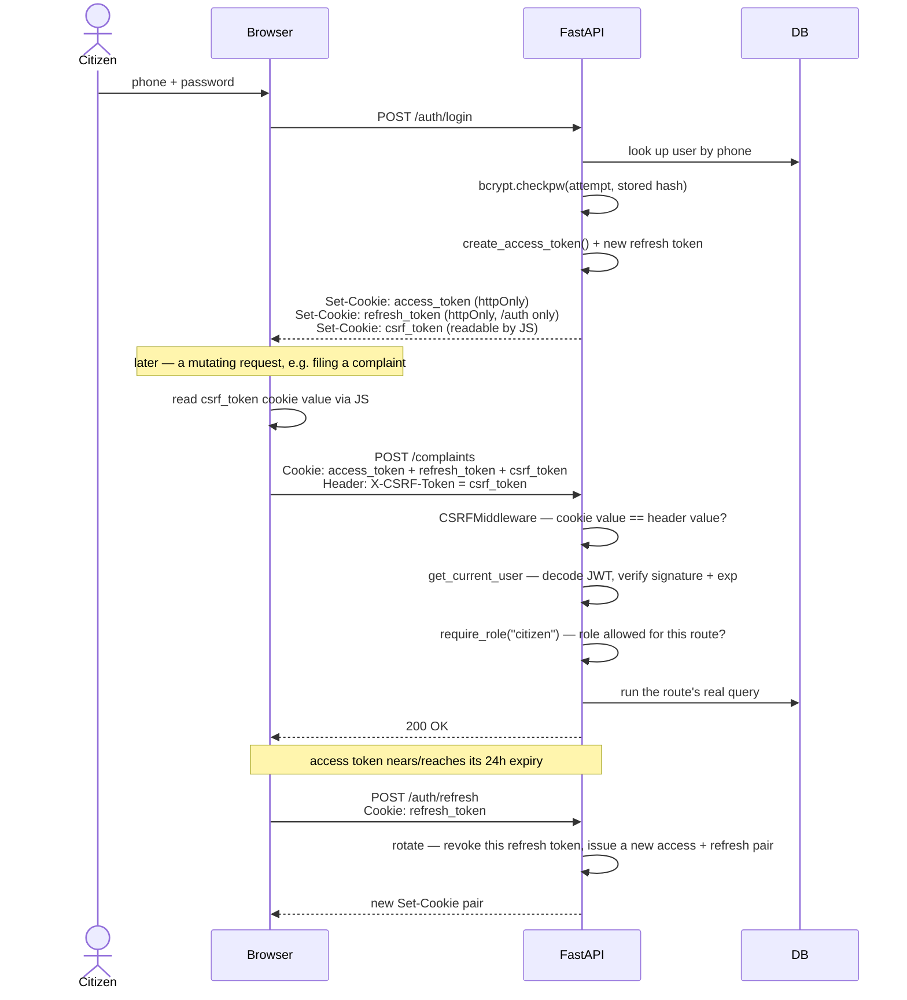

# Authentication — Passwords, JWTs, and Roles, from the Ground Up

*Written for someone who wants to actually understand this, not just skim it — including "why did you build it this way" answers you could give in an interview.*

> Part of the JanSarthi AI documentation set. See [`README.md`](../README.md) for the full index of every document.

---

## 1. The problem authentication solves

Two separate questions, easy to blur together but genuinely different:

- **Authentication** — "who are you?" (proving your identity, usually with a password)
- **Authorization** — "are you allowed to do this?" (once we know who you are, what can you actually access?)

JanSarthi AI handles authentication via phone number + password, and authorization via a `role` (citizen/worker/admin) attached to your account. Both are implemented in [`backend/services/auth_service.py`](../backend/services/auth_service.py) and enforced in [`backend/deps.py`](../backend/deps.py).

---

## 2. Passwords: why you never store the real one

If you store a user's actual password in the database and that database ever leaks, every user's real password leaks with it — and because people reuse passwords, that's not just a problem for this app, it's a problem for every other account that person used the same password on.

The fix: **hash** the password before storing it. A hash function turns "correcthorsebatterystaple" into something like `$2b$12$KIXQ...` — a one-way transformation that's practically impossible to reverse. To check a login attempt, you hash the *attempt* and compare it to the *stored hash* — the real password is never stored anywhere, ever, not even briefly in the database.

```python
# backend/services/auth_service.py
def hash_password(password: str) -> str:
    return bcrypt.hashpw(password.encode("utf-8"), bcrypt.gensalt()).decode("ascii")

def verify_password(password: str, password_hash: str) -> bool:
    return bcrypt.checkpw(password.encode("utf-8"), password_hash.encode("ascii"))
```

**Why `bcrypt` specifically, not something like plain SHA-256?** This is a genuinely important interview-level distinction. A general-purpose hash function like SHA-256 is *fast* — which is exactly the wrong property for a password hash. Fast hashing means an attacker with a stolen database of hashes can try billions of password guesses per second against it. `bcrypt` is deliberately, tunably **slow** (it has a "cost factor" built in), which makes large-scale guessing attacks impractical even if the hashed data leaks. It also automatically generates and stores a random **salt** per password (`bcrypt.gensalt()`), so two users with the same password get completely different hashes — defeating precomputed "rainbow table" attacks.

---

## 3. What a JWT actually is

**JWT** stands for JSON Web Token. It's a compact, **signed** piece of text that encodes some claims (like "user 12, role citizen") in a way that can't be tampered with, without needing the server to remember anything about active sessions.

A JWT has three parts, separated by dots: `header.payload.signature` — for example:
```
eyJhbGciOiJIUzI1NiJ9.eyJzdWIiOiIxMiIsInJvbGUiOiJjaXRpemVuIn0.4f3a...
└── header ──────────┘└── payload ─────────────────────────┘└ signature ┘
```

- **Header** — which algorithm was used to sign it (`HS256` here).
- **Payload** — the actual claims: who this token is for, their role, when it expires. **This part is only encoded, not encrypted** — anyone can decode and read it (it's just base64). Never put a secret *inside* a JWT's payload; the security comes from the signature, not from the payload being hidden.
- **Signature** — a cryptographic proof, computed from the header+payload plus a **secret key only the server knows**, that the token wasn't tampered with. Change even one character of the payload, and the signature no longer matches — the server rejects it immediately.

**Why JWTs instead of traditional server-side sessions?** This is one of the most common "explain your architecture" interview questions. With traditional sessions, the server stores a session ID in memory or a database, and the browser just holds that ID in a cookie — the server has to look up "what does session ID X mean" on every request. With JWTs, **all the information is in the token itself** — the server can verify it's genuine (via the signature) without storing anything or querying a database, just by checking the signature and reading the payload. This makes JWTs a natural fit for APIs that might eventually run across multiple server instances (no shared session store needed) — though the honest trade-off is that a JWT can't be instantly revoked before it expires, unlike a server-side session you can just delete.

---

## 4. How this codebase implements JWTs — and a real interview talking point

Most projects reach for a library like `PyJWT`. This one **doesn't** — `auth_service.py` implements JWT creation and verification directly against Python's standard library (`hmac`, `hashlib`, `json`, `base64`), and says exactly why in its own docstring:

> "JWTs are implemented directly against the standard library (HS256 only) rather than a third-party JWT package, since this project only ever needs to verify tokens it issued itself with one shared secret — no external issuers, no key rotation, no asymmetric signing. This keeps the dependency surface small."

This is worth understanding well because it's a genuinely good, defensible engineering decision to be able to explain, not just a curiosity:

- A full JWT library supports many algorithms, external token issuers, key rotation, asymmetric (public/private key) signing — real complexity that exists to solve problems this app doesn't have. This app only ever issues its own tokens and verifies them with the one secret it already holds.
- Implementing the (much smaller) actual need directly means **one fewer third-party dependency** to keep updated and trust, for a well-understood, ~100-line piece of code that can be read and audited in full.
- The trade-off, worth stating honestly: hand-rolling security-adjacent code is *usually* a bad idea — you're one bug away from creating a real vulnerability. This is only defensible because (a) it's simple enough to actually reason about completely, (b) it uses `hmac.compare_digest()` for the signature check specifically to avoid **timing attacks** (see below), and (c) it's thoroughly tested (see [`docs/TESTING.md`](TESTING.md), including property-based tests). A more complex auth scheme should absolutely use a battle-tested library instead.

### The signature check, and why `hmac.compare_digest` matters

```python
if not hmac.compare_digest(expected_signature, actual_signature):
    raise InvalidTokenError("Invalid token signature.")
```

A naive `expected_signature == actual_signature` in Python compares byte-by-byte and **returns as soon as it finds a mismatch** — which means comparing a totally-wrong signature is measurably faster than comparing an almost-right one. An attacker who can measure response times precisely could, in theory, exploit that timing difference to guess the correct signature one byte at a time — a **timing attack**. `hmac.compare_digest` always takes the same amount of time regardless of how much of the two values matches, closing that hole. This is exactly the kind of small, specific detail that separates "I copied JWT code from a tutorial" from "I understand what I built" in an interview.

---

## 5. The request lifecycle: from header (or cookie) to authorized action

1. Login succeeds → `create_access_token(user)` builds a JWT containing `sub` (the user's ID), `role`, `iat` (issued-at), and `exp` (expiry, `JWT_EXPIRE_MINUTES` from now — 24 hours by default).
2. **A real browser session no longer stores this token itself at all.** `login`/`signup`/`refresh` call `deps.set_auth_cookies`, which sets it as an **httpOnly** `access_token` cookie (plus an httpOnly `refresh_token` cookie, scoped to `/auth`, and a separate non-httpOnly `csrf_token` cookie — see §5a below) — the browser attaches these automatically on every request to this origin from then on. The frontend keeps the access token in plain React state for the lifetime of the tab (never `localStorage`, see `frontend-react/src/lib/auth.tsx`'s own docstring) purely so it can display things like "logged in as X" without a network round trip; a hard reload starts that state at `null` and silently re-derives a real session from the httpOnly `refresh_token` cookie instead. An explicit `Authorization: Bearer <token>` header still works too — it's what every test and any non-browser API client uses — and takes priority if both are somehow present.
3. `deps.get_current_user` looks for the Bearer header first, then falls back to the `access_token` cookie (`deps.extract_access_token`), calls `decode_access_token`, which verifies the signature and checks `exp` hasn't passed, then looks up the real `User` row by the `sub` claim.
4. `deps.require_role("admin")` (or any role) wraps `get_current_user` and additionally checks the resolved user's `role` is in the allowed list, rejecting with `403 Forbidden` otherwise.

This is FastAPI's **dependency injection** at work — a route just declares `admin: User = Depends(require_role("admin"))` as a parameter, and all of the above happens automatically before the route's own code runs at all. See [`docs/BACKEND.md`](BACKEND.md) for more on this pattern.

**The same lifecycle, as a sequence diagram** — login, a real cookie-authenticated mutating request (with the CSRF check from §5a inline), then a refresh (§5b):



### 5a. Why a cookie needs its own CSRF protection (and this app's fix)

Moving the tokens into httpOnly cookies closes off one attack (a malicious script on the page can no longer just read `localStorage` and steal the token) but opens a different one: a browser attaches cookies to **any** request to this origin, including one a malicious page on a completely different site tricks the citizen's browser into firing — a **Cross-Site Request Forgery (CSRF)** attack. A plain `Authorization` header doesn't have this problem, since only same-origin JavaScript can construct and attach a custom header in the first place — which is exactly what closes the gap here too.

The fix (`backend/middleware.py`'s `CSRFMiddleware`) is the standard **double-submit cookie** pattern: alongside the two httpOnly cookies, the server also sets a third, deliberately **non-httpOnly** `csrf_token` cookie. The frontend reads that cookie's value with JavaScript and echoes it back as an `X-CSRF-Token` header on every request that changes something (`POST`/`PUT`/`PATCH`/`DELETE`). The middleware then just checks the cookie value and the header value match. A forged cross-site request can make the browser *send* the cookie automatically, but it can't *read* the cookie's value to also put it in the header — so the two values won't match, and the middleware rejects it with `403`. This check is skipped entirely for a request authenticating via a plain Bearer header (nothing cross-site can forge that) and for safe, read-only methods (`GET`/`HEAD`/`OPTIONS`), which never mutate anything in the first place.

### 5b. Refresh-token rotation and reuse detection

Each `POST /auth/refresh` call (`auth_service.rotate_refresh_token`) doesn't just issue a new access token — it **revokes the old refresh token and issues a brand new one** ("rotation"), rather than letting one refresh token be reused indefinitely for the full `REFRESH_TOKEN_EXPIRE_DAYS` window. If a refresh token is ever presented *after* it's already been rotated away, that's treated as a strong signal the token leaked and someone else is trying to use it — the server responds by revoking **every** active session for that user, not just the one that got reused, forcing a fresh login everywhere. This is why the frontend's silent-refresh calls are carefully deduplicated (`api.ts`'s `silentRefresh()`) rather than fired independently from every page: two near-simultaneous refresh calls would otherwise race each other's rotation and trip this exact reuse-detection path against a legitimate session.

---

## 6. Authorization: three roles, enforced two ways

- **Route-level** — `require_role(...)` blocks an entire endpoint from the wrong role before any of its logic runs (e.g., only `admin` can reach `POST /admin/workers`).
- **Row-level** — inside a route, an explicit ownership check (e.g., `_get_owned_complaint` in `routes/complaints.py`) confirms a specific *record* belongs to the caller, not just that their role is generally allowed — a worker being allowed to accept complaints in general doesn't mean they should be able to accept *any* complaint's ID they happen to guess.

**Why there's no way to self-register as a worker or admin, at all, anywhere:** this isn't an oversight — `routes/auth.py`'s sign-up endpoint has no `role` field in its request model whatsoever, so there is no code path, no matter what a malicious client sends, that can result in anything but a citizen account. The very first admin account is planted directly into the database by a script (`scripts/seed_admin.py`), run by whoever is setting the system up — never through the running application itself. This is a strong, simple security property: "can an attacker escalate their own privileges through the API" has a provably-no answer, because the capability doesn't exist in the API surface at all.

---

## Likely interview questions about this part of the project

**"Why JWTs instead of sessions?"** — stateless verification (no server-side session store needed), a natural fit for an API consumed by a separate frontend. Trade-off: can't be instantly revoked before expiry, unlike deleting a server-side session. See [§3](#3-what-a-jwt-actually-is).

**"How do you store passwords?"** — bcrypt, never the plaintext, with bcrypt chosen specifically for being deliberately slow (resists brute-force) and self-salting (resists rainbow tables), unlike a fast general-purpose hash. See [§2](#2-passwords-why-you-never-store-the-real-one).

**"Why didn't you use a JWT library?"** — the app's actual need (self-issued tokens, one shared secret, no key rotation) is a small subset of what a full library solves for; implementing it directly against the standard library keeps the dependency surface small and the whole implementation auditable. Trade-off acknowledged: this is only defensible because it's simple, uses `hmac.compare_digest` to avoid timing attacks, and is well-tested. See [§4](#4-how-this-codebase-implements-jwts--and-a-real-interview-talking-point).

**"How do you prevent privilege escalation?"** — there is no code path anywhere in the API that can create a worker or admin account; sign-up's request model has no `role` field at all. The first admin is seeded directly into the database, outside the running application. See [§6](#6-authorization-three-roles-enforced-two-ways).

**"What's a timing attack, and where does it matter in your code?"** — see the `hmac.compare_digest` explanation in [§4](#4-how-this-codebase-implements-jwts--and-a-real-interview-talking-point). A genuinely great detail to bring up unprompted.

**"Where do you actually store the token in the browser?"** — an httpOnly cookie, not `localStorage`. A script on the page (including one injected via XSS) can't read an httpOnly cookie's value at all, whereas anything in `localStorage` is trivially readable by any JS running on the page. The trade-off this opens up is CSRF, not XSS-based token theft — see the next question. See [§5](#5-the-request-lifecycle-from-header-or-cookie-to-authorized-action).

**"If the token's in a cookie now, how do you stop CSRF?"** — the double-submit cookie pattern: a third, non-httpOnly `csrf_token` cookie that the frontend must read with JS and echo back as a request header, which a forged cross-site request can't do (it can make the cookie ride along automatically, but can't read its value to also attach the header). See [§5a](#5a-why-a-cookie-needs-its-own-csrf-protection-and-this-apps-fix).

**"What happens if a refresh token leaks?"** — refresh tokens rotate on every use, and presenting an already-rotated (i.e., already-used) one is treated as reuse/compromise, revoking every active session for that user, not just the one token. See [§5b](#5b-refresh-token-rotation-and-reuse-detection).

---

*Related reading: [`docs/BACKEND.md`](BACKEND.md), [`docs/DATABASE.md`](DATABASE.md), [`docs/TESTING.md`](TESTING.md).*
