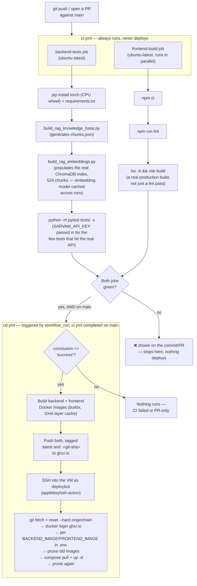

# CI/CD — GitHub Actions, in Depth

*Written for someone who wants to actually understand this, not just skim it — including "why did you build it this way" answers you could give in an interview.*

> Part of the JanSarthi AI documentation set. See [`README.md`](../README.md) for the full index of every document. [`docs/DEPLOYMENT_GCP.md`](DEPLOYMENT_GCP.md) covers the same pipeline from the "how do I set up and operate the server" side — this doc is the deep dive on the two workflow files themselves.

---

## 1. CI vs. CD vs. "CI/CD"

- **CI = Continuous Integration.** Every time code is pushed or a PR is opened, a robot (GitHub
  Actions) automatically checks it: does it build, do the tests pass. It does **not** deploy
  anything anywhere — it only tells you "this code is good" or "this code is broken," automatically,
  instead of relying on a human to remember to run tests before every push.
- **CD = Continuous Deployment.** The next step after CI: if the code passed CI on `main`,
  automatically ship it to the live server, with no manual "SSH in and update it" step.
- Both are **GitHub Actions workflows** — YAML files under `.github/workflows/` that GitHub itself
  reads and runs on its own machines ("runners") whenever the trigger at the top of the file (`on:`)
  matches.

## 2. The full pipeline, visually



## 3. `ci.yml` — job by job

Two jobs, run in parallel on fresh GitHub-hosted machines — nothing from your laptop or the
production VM is involved in CI at all.

### `backend-tests`

1. **Install dependencies** — torch's CPU-only wheel isn't on the default PyPI index, so it's
   installed from `download.pytorch.org/whl/cpu` explicitly *before* the rest of
   `requirements.txt`; a plain `pip install -r requirements.txt` would otherwise pull the much
   larger CUDA build, which GitHub's runners don't even have a GPU to use.
2. **Build the RAG knowledge base** (`scripts/build_rag_knowledge_base.py`) — `chunks.json` is a
   generated file, deliberately not committed to git (same as the production Docker build).
   `backend/routes/ask_janmitra.py` builds its service at **module import time**, and every test
   imports `backend.main` via `conftest.py` — without this step, the entire suite would fail with
   `FileNotFoundError` before a single test even runs, regardless of what that test is about.
3. **Build the real ChromaDB index** (`scripts/build_rag_embeddings.py`) — populates the actual
   524-chunk vector index `RagRetriever` searches against. Without it, every retrieval test would
   open an empty collection and every query would come back `insufficient_knowledge`, independent
   of whether the retrieval logic is actually correct. The embedding model
   (`intfloat/multilingual-e5-small`, ~470MB) is cached (`actions/cache@v4`, keyed
   `hf-multilingual-e5-small`) so only the first run after a cache-key change re-downloads it.
4. **Run the suite** — `python -m pytest tests/ -v` (the `-m` form, not bare `pytest`, so the repo
   root is reliably on `sys.path` and `backend` resolves as a package). `SARVAM_API_KEY` is scoped
   to just this one step: most tests mock the Sarvam client entirely, but a few deliberately call
   the *real* API to prove real behavior (e.g. language auto-detection from actual text) — those
   silently fall back to a weaker default without a real, funded key configured as a repo secret.
   One test is expected to self-skip (it needs a legacy TF-IDF index this job doesn't build) — see
   `ci.yml`'s own comment for exactly which one, so a *different* skip doesn't go unnoticed.

### `frontend-build`

`npm ci` → `npm run lint` → `tsc -b && vite build`. The last step is a **real production build**,
not just a lint pass — it catches TypeScript type errors and build breakage that linting alone
would miss.

**Deliberately not run in CI**: the Playwright end-to-end suite (`frontend-react/e2e/`). It
exercises the full stack against a live backend, including the real Sarvam voice/translation
pipeline — needs a real `SARVAM_API_KEY`, takes several minutes, and (per this repo's own notes)
has already needed real-pipeline-timing tuning (30s+ waits) that doesn't suit a hard CI gate. Run
`npx playwright test` locally before merging any change that touches routing, the complaint
wizard, or voice input.

## 4. `cd.yml` — job by job

Triggered by `workflow_run: { workflows: ["CI"], branches: [main], types: [completed] }`, gated by
`if: github.event.workflow_run.conclusion == 'success'` — this is a real, structural guarantee, not
just a convention: **there is no code path in this file that can deploy something CI didn't pass.**

### `build-and-push`

1. `docker/setup-buildx-action` + `docker/login-action` (GHCR, using the automatic
   `GITHUB_TOKEN` — no separate registry credential needed).
2. Build + push the **backend** image (`backend/Dockerfile`), tagged both `:latest` and
   `:${{ github.sha }}` — the SHA tag is what rollback (§5) targets.
3. Build + push the **frontend** image (`frontend-react/Dockerfile`), same two tags, **plus**
   `VITE_SENTRY_DSN`/`VITE_SENTRY_ENVIRONMENT` passed as Docker `build-args`. This one is easy to
   get wrong: Vite environment variables are baked in at **build** time, not read at container
   startup — so unlike every other secret (which lives in the server's `.env` and is read when the
   container starts), the frontend Sentry DSN has to be threaded through here, into the image
   itself, or it's simply not in the shipped JS bundle at all. Both use `cache-from/to: type=gha`,
   so unchanged Docker layers aren't rebuilt on every run.

### `deploy` (needs `build-and-push`)

SSHes into the VM as `deploybot` (`appleboy/ssh-action`, using the `SSH_HOST`/`SSH_USER`/
`SSH_PRIVATE_KEY`/`SSH_PORT`/`SSH_DEPLOY_PATH` secrets — see
[`docs/DEPLOYMENT_GCP.md`](DEPLOYMENT_GCP.md) for why `deploybot` and not a personal account), then
on the server:

1. `git fetch origin main && git checkout main && git reset --hard origin/main` — so a change to
   `docker-compose.prod.yml` or `deploy/Caddyfile` themselves also lands, not just app code.
2. `docker login ghcr.io` with the same `GITHUB_TOKEN` used to push, piped via stdin (never as a
   plain CLI argument, which would leak it into shell history/process listings).
3. Rewrites `.env`'s `BACKEND_IMAGE`/`FRONTEND_IMAGE` to the just-built `:${{ github.sha }}` tags —
   an **upsert**, not an append (the old lines are stripped with `grep -v` before the new ones are
   written), and deliberately persisted to disk rather than only passed as a one-off environment
   variable, so a plain `docker compose up -d` after a server reboot re-pulls the *last-deployed*
   images, not `:latest` (which may have moved since).
4. The same upsert pattern turns on `PHOENIX_TRACING=true` in production on every deploy — see
   [`docs/OBSERVABILITY.md`](OBSERVABILITY.md) — so enabling AI tracing is a one-line change to this
   workflow file, never a manual SSH-in-and-hand-edit of the server's `.env`.
5. `docker image prune -af` **before and after** pulling — a real incident, not a defensive
   habit: pruning only *after* isn't enough, because the *previous* deploy's still-tagged image
   never gets removed by a plain `docker image prune -f` (no `-a`), and those accumulate deploy
   over deploy until the VM's disk fills up and the next `pull` itself fails with "no space left on
   device" — which then skips the prune-after step too (the script exits on error), so the failure
   compounds on the deploy after that. Pruning right before `pull` as well breaks that loop.
6. `docker compose -f docker-compose.prod.yml pull && ... up -d` — the actual "go live" step.

## 5. Rollback

Every image is tagged with its commit SHA, not just `latest` — rolling back means pointing `.env`
at an older tag and reapplying, not reverting any code:

```bash
sudo -u deploybot bash -c 'cd /home/deploybot/jansarthi-ai && \
  sed -i "s/^BACKEND_IMAGE=.*/BACKEND_IMAGE=ghcr.io\/<owner>\/<repo>-backend:<good-sha>/" .env && \
  sed -i "s/^FRONTEND_IMAGE=.*/FRONTEND_IMAGE=ghcr.io\/<owner>\/<repo>-frontend:<good-sha>/" .env && \
  docker compose -f docker-compose.prod.yml pull && \
  docker compose -f docker-compose.prod.yml up -d'
```

## 6. Secrets this pipeline actually needs

| Secret | Used by | Purpose |
|---|---|---|
| `SARVAM_API_KEY` | `ci.yml` | Lets the handful of real-API tests run for real instead of silently degrading |
| `VITE_SENTRY_DSN` / (implicit) `VITE_SENTRY_ENVIRONMENT` | `cd.yml` build step | Baked into the built frontend JS bundle at image-build time |
| `SSH_HOST` / `SSH_USER` / `SSH_PRIVATE_KEY` / `SSH_PORT` / `SSH_DEPLOY_PATH` | `cd.yml` deploy step | Where and how to reach the production VM as `deploybot` |
| `GITHUB_TOKEN` | both | Automatic, provided by GitHub itself — no manual setup, used for both pushing images to GHCR and the VM's own `docker login` |

## 7. Likely interview questions about this part of the project

**"Walk me through what happens when you merge a PR."** — CI re-runs on `main`; once green, CD
triggers via `workflow_run` (not a second `push` trigger — see §4), builds and tags both Docker
images by commit SHA, pushes to GHCR, then SSHes into the production VM and swaps the running
containers for the new images. See §2's diagram.

**"How do you guarantee broken code never gets deployed?"** — `cd.yml`'s trigger is gated on
`github.event.workflow_run.conclusion == 'success'` — a structural guarantee at the workflow level,
not a convention a developer has to remember to follow.

**"How would you roll back a bad deploy?"** — every image is tagged with its commit SHA in
addition to `latest`; rollback just repoints `.env` at an older SHA tag and re-runs
`compose pull && up -d`. See §5.

**"What's the trickiest bug you've hit in this pipeline?"** — disk filling up on the VM because
`docker image prune -f` (no `-a`) never removed the *previous* deploy's still-tagged image, only
ever-dangling layers — see §4 step 5's prune-before-and-after fix.

---

*Related reading: [`docs/DEPLOYMENT_GCP.md`](DEPLOYMENT_GCP.md), [`docs/TESTING.md`](TESTING.md).*
