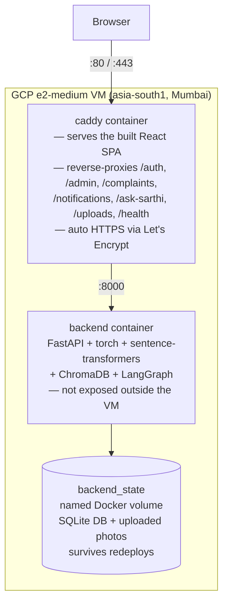
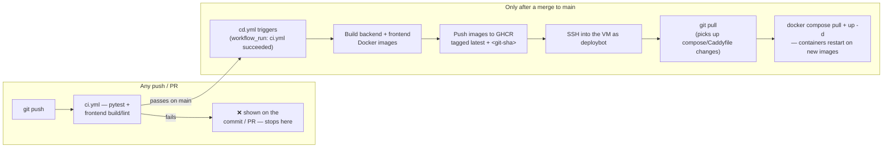

# Deployment — Google Cloud (this is the real, live production deployment)

> **This is the canonical, current production deployment.** It was originally adopted as a bridge
> while Oracle Cloud signup was blocked (Oracle's Always Free tier was the original plan — cheaper
> long-term, up to 24GB RAM), and stayed live past that point rather than migrating back. As of
> today, **the real app runs on GCP, not Oracle** — Oracle was never actually used for anything
> beyond a blocked signup attempt. This doc is fully self-contained: nothing below depends on
> anything Oracle-specific.

## Architecture

Everything runs on a single VM: two Docker containers, one reverse proxy in front.



Why one VM instead of splitting the frontend onto Vercel/Netlify: the backend needs a real,
persistent disk (SQLite DB + uploaded photos) and real RAM for torch/sentence-transformers/
ChromaDB — that already rules out most serverless "free FastAPI hosting." Given that, putting the
static frontend on the same box removes an entire second vendor and avoids a cross-origin hop for
every API call.

## What all these files actually are

A plain-language glossary of every deployment-related file in this repo.

- **`.github/workflows/ci.yml`** — runs on every push/PR: `pytest` for the backend, lint + a real
  production build (`tsc -b && vite build`) for the frontend. Never touches the VM or deploys
  anything; only ever runs checks.
- **`.github/workflows/cd.yml`** — runs only after `ci.yml` succeeds on `main`. Builds both Docker
  images, pushes them to **GHCR** (GitHub Container Registry), then SSHes into the VM as
  `deploybot` and tells it to pull the new images and restart. This is the file that makes a
  `git push` actually end up live — see "How CI/CD works day to day" below.
- **`backend/Dockerfile`** / **`frontend-react/Dockerfile`** — build instructions for each half of
  the app. Two separate files because the backend (Python) and frontend (Node → static files
  served by Caddy) are built completely differently.
- **`docker-compose.prod.yml`** — how the two built images actually run together on the VM: which
  network, which persistent volumes, restart policy. `docker compose -f docker-compose.prod.yml up
  -d` is the real "start/update the live app" command; `cd.yml` just runs it for you automatically.
- **`deploy/Caddyfile`** — the reverse proxy's config: serve the built React files for normal
  requests, hand off `/auth`, `/admin`, etc. to the backend container, and get an HTTPS
  certificate automatically once a real domain (or DuckDNS subdomain) is set.
- **`.dockerignore`** — keeps `node_modules/`, `.git/`, local `.env` secrets, and the SQLite
  database out of the built images.

## Your account status

You already created the GCP account and clicked "upgrade to full account" — so this is a **paid
billing account with $300 (~₹28,694) trial credit**, expiring **11 November 2026**. That's fine
— upgrading itself isn't a mistake, it just means billing is *live* instead of impossible, so
you need a plan for when the credit runs out rather than assuming nothing happens. Because of
this, you actually have **two real options**, not one:

| | Option A — Free `e2-micro` | Option B — Paid `e2-medium` (uses your credit) |
|---|---|---|
| Cost | $0, forever | ~$25-30/month, paid from your existing $300 credit |
| RAM | 1GB — needs a swap file, expect real slowdowns | 4GB — comfortable real headroom, no swap needed |
| Region | US only (Oregon/Iowa/South Carolina) — no India region on the free tier | **Mumbai** (`asia-south1`) — real latency to your users |
| Time limit | None | Until the credit runs out (~11 Nov 2026), or you decide to keep paying |
| Best for | Long-term $0 hosting once you've decided this is where the app stays | Right now, while you're still deciding — the credit is sitting there either way |

**My take:** go with **Option B** right now. That $300 credit expires in ~90 days no matter what
you do with it — running a properly-sized VM for those 90 days costs a small fraction of it and
gives you an app that actually performs well, instead of deliberately crippling it on Option A
while unused credit sits on the table. The decision that actually matters — free forever vs.
paying vs. migrating to Oracle — is one you make *at* the 90-day mark, not now.

### Why Option A's 1GB is actually tight (not just "a bit less")

This backend loads several things into memory at once, and `backend/main.py`'s startup
deliberately warms the embedding model eagerly (so the first real request isn't slow) — meaning
this is memory the app claims immediately on boot, not just under peak load:

| Component | Approx. RAM |
|---|---|
| Python + FastAPI + uvicorn baseline | ~100MB |
| torch (just importing it) | ~200-300MB |
| sentence-transformers model (multilingual-e5-small), loaded | ~500-700MB |
| ChromaDB | ~100-200MB |
| LangGraph/LangChain orchestration | ~50-100MB |
| **Backend total, just sitting idle** | **~950MB-1.4GB** |

That's before the OS, Docker itself, and the Caddy container (which also has to fit on the same
1GB VM) take their share. So on Option A, a swap file isn't a "nice to have" — without it, expect
the backend to get OOM-killed at startup or on the first Ask Sarthi request. Swap doesn't add
real memory either; it lets the OS spill overflow onto disk instead of crashing, which is roughly
100-1000x slower than RAM — it turns "crashes" into "works, but noticeably slower," not into
"works properly." Option B's 4GB avoids all of this outright.

## Step 0 (do this first, whichever option you pick): budget alert + a calendar reminder

1. In the Console: **Billing → Budgets & alerts → Create budget**. Set it to something like
   ₹5,000 (well under your ₹28,694) so you get an email if usage spikes unexpectedly. Note this
   only *alerts* you — it doesn't stop anything automatically.
2. **Set an actual calendar reminder for ~1 November 2026** (10 days before the credit expires)
   to act on the "Before the credit runs out" section below. This matters more than the budget
   alert — an alert you ignore doesn't stop a bill.

## One-time setup

### 1. Create the VM (Console walkthrough)

Go to [console.cloud.google.com](https://console.cloud.google.com), make sure the right project
is selected in the top bar (the `project-0977686d-...` one from your screenshot), then:

1. **Left-side hamburger menu (☰) → Compute Engine → VM instances.** First time opening
   Compute Engine on a project takes ~30-60 seconds to "enable the API" — just wait, it's normal.
2. Click **Create Instance** (top of the page).
3. **Name**: `janmitra-vm` (or anything — this is just a label).
4. **Region** and **Zone** — pick based on your option:
   - **Option B (recommended)**: Region = `asia-south1 (Mumbai)`, Zone = `asia-south1-a`.
   - **Option A (free)**: Region = `us-central1 (Iowa)` (or `us-west1`/`us-east1`), Zone = any
     `-a`/`-b`/`-c` under it. Must be one of these three regions or it won't be Always Free.
5. **Machine configuration** — scroll to the machine type section:
   - **Option B**: family "E2", machine type `e2-medium` (2 vCPU, 4GB memory).
   - **Option A**: family "E2", machine type `e2-micro` (2 vCPU shared-core, 1GB memory).
6. **Boot disk** — click **Change** (it defaults to Debian, you want Ubuntu):
   - Operating system: **Ubuntu**
   - Version: **Ubuntu 24.04 LTS**
   - Boot disk type: Standard persistent disk (leave default)
   - Size: **30** GB
   - Click **Select** to confirm and close that panel.
7. **Firewall** section (further down the same page): check both
   **"Allow HTTP traffic"** and **"Allow HTTPS traffic"**. This is the *only* firewall step
   needed on GCP — no separate `iptables` step on the VM itself like Oracle requires.
8. Everything else: leave as default.
9. Click **Create** at the bottom. It takes maybe 30-60 seconds to boot; you'll land back on the
   VM instances list and see it appear with a green checkmark once it's running, along with its
   **External IP** — note that IP down, you'll need it for the domain and GitHub secrets steps
   later.
10. To SSH in: click the **SSH** button directly in that instance's row in the console — it
    opens a browser-based terminal and handles your SSH key for you automatically, no key setup
    needed on your end.

If you'd rather use the `gcloud` CLI instead of clicking through the Console, here's the
equivalent (only if you already have `gcloud` installed and authenticated):

```bash
# Option B -- e2-medium in Mumbai
gcloud compute instances create janmitra-vm \
  --zone=asia-south1-a \
  --machine-type=e2-medium \
  --image-family=ubuntu-2404-lts-amd64 \
  --image-project=ubuntu-os-cloud \
  --boot-disk-size=30GB \
  --tags=http-server,https-server

# Option A -- free e2-micro (pick one region: us-west1, us-central1, or us-east1)
gcloud compute instances create janmitra-vm \
  --zone=us-central1-a \
  --machine-type=e2-micro \
  --image-family=ubuntu-2404-lts-amd64 \
  --image-project=ubuntu-os-cloud \
  --boot-disk-size=30GB \
  --tags=http-server,https-server

# Either way, also run this once (same firewall rule for both options)
gcloud compute firewall-rules create allow-http-https \
  --allow=tcp:80,tcp:443 --target-tags=http-server,https-server
```

### 2. Install Docker

SSH into the VM (Console's "SSH" button, or `gcloud compute ssh janmitra-vm --zone=<your-zone>`):

```bash
curl -fsSL https://get.docker.com | sudo sh
sudo usermod -aG docker $USER
newgrp docker
docker compose version   # confirm the Compose plugin is present
```

**Option A only** — also add swap, or the backend will very likely get OOM-killed on startup or
on the first Ask Sarthi request (1GB isn't enough on its own for torch + sentence-transformers
+ ChromaDB together):

```bash
sudo fallocate -l 4G /swapfile
sudo chmod 600 /swapfile
sudo mkswap /swapfile
sudo swapon /swapfile
echo '/swapfile none swap sw 0 0' | sudo tee -a /etc/fstab   # persists across reboots
free -h   # confirm swap shows up
```

**Option B** doesn't need this — 4GB is real headroom for this stack.

### 3. Clone the repo and set up secrets

```bash
git clone https://github.com/<owner>/<repo>.git
cd <repo>
cp .env.example .env
nano .env   # fill in SARVAM_API_KEY, JWT_SECRET_KEY (generate one: openssl rand -hex 32), etc.
```

Leave `BACKEND_IMAGE` / `FRONTEND_IMAGE` / `SITE_ADDRESS` unset in `.env` for now — the CD
workflow manages the first two, and `SITE_ADDRESS` only matters once you have a domain (step 6).

### 4. First deploy

Identical commands either way:

```bash
docker compose -f docker-compose.prod.yml up -d --build
curl http://localhost/health
```

**Option A only**: watch memory while it starts (`docker stats` in another SSH session) — if the
backend container restarts repeatedly right after boot, that's the OOM killer; confirm swap is
actually active (`free -h` should show a non-zero Swap line) before troubleshooting further.

### 5. Set up automated deployment (GitHub Actions CD)

This wires up `.github/workflows/cd.yml` so every merge to `main` automatically deploys to this
VM, instead of you SSHing in and running `docker compose` by hand each time.

**a) Generate a dedicated deploy keypair** (on your own laptop, not the VM — this key's private
half becomes a GitHub secret, its public half goes on the VM):

```bash
ssh-keygen -t ed25519 -f ~/.ssh/janmitra_deploy_key -N "" -C "github-actions-deploy"
```

Don't reuse your personal SSH key here — a dedicated key means you can revoke deploy access
later (by removing it from the VM's `authorized_keys`) without touching your own login.

**b) Create a dedicated `deploybot` account on the VM — do NOT put the key on your own account.**

This is important enough to explain up front rather than after something breaks: **your own
account (the one matching your Google login) will not work reliably for this, even if you set it
up correctly.** Google Cloud VMs run a background service that periodically resets your personal
account's SSH access, tied to your browser login sessions — so a key added to your own account
gets silently wiped out at unpredictable times, hours after it looked like it worked. This isn't a
mistake you can avoid by being more careful; it's how GCP manages personal accounts, and it will
happen no matter how correctly the key is added. See "Understanding the `deploybot` account" below
for the full story if you hit this.

The fix is a separate account that Google's account-recycling never touches, because it isn't tied
to any Google login. SSH into the VM (Console's SSH button) as yourself and run:

```bash
sudo useradd -m -s /bin/bash deploybot
sudo usermod -aG docker deploybot
sudo mkdir -p /home/deploybot/.ssh
echo "<paste the contents of ~/.ssh/janmitra_deploy_key.pub here>" | sudo tee /home/deploybot/.ssh/authorized_keys
sudo chown -R deploybot:deploybot /home/deploybot/.ssh
sudo chmod 700 /home/deploybot/.ssh
sudo chmod 600 /home/deploybot/.ssh/authorized_keys
```

**c) Give `deploybot` its own clone of the repo, with secrets configured:**

```bash
sudo -u deploybot git clone https://github.com/<your-username>/jansarthi-ai.git /home/deploybot/jansarthi-ai
sudo -u deploybot cp /home/deploybot/jansarthi-ai/.env.example /home/deploybot/jansarthi-ai/.env
sudo -u deploybot nano /home/deploybot/jansarthi-ai/.env
# fill in SARVAM_API_KEY, set JWT_SECRET_KEY to a fixed value (openssl rand -hex 32), and set
# ENVIRONMENT=production -- required together: the backend now refuses to start with
# ENVIRONMENT=production and a blank JWT_SECRET_KEY (see backend/main.py's
# _check_production_secrets()), rather than silently falling back to a random per-process key.
# Setting JWT_SECRET_KEY alone without ENVIRONMENT=production does NOT enable this check.
```

(If you already have a working `.env` filled in under your own account's clone, it's simpler to
copy that instead of retyping everything: `sudo cp /home/<you>/jansarthi-ai/.env
/home/deploybot/jansarthi-ai/.env && sudo chown deploybot:deploybot
/home/deploybot/jansarthi-ai/.env`.)

**d) Get the VM's external IP** — either from the Console (Compute Engine → VM instances →
External IP column), or by running this on the VM:

```bash
curl -s ifconfig.me
```

**e) Add the 5 GitHub secrets.** Either via the GitHub web UI (**repo → Settings → Secrets and
variables → Actions → New repository secret**), or with the `gh` CLI from your laptop if you have
it installed and authenticated:

```bash
gh secret set SSH_HOST --body "<the VM's external IP from step d>"
gh secret set SSH_USER --body "deploybot"
gh secret set SSH_PRIVATE_KEY < ~/.ssh/janmitra_deploy_key
gh secret set SSH_DEPLOY_PATH --body "/home/deploybot/jansarthi-ai"
```

`SSH_PORT` is optional — the workflow defaults to `22` if you don't set it. **On Windows/Git
Bash specifically**: prefer piping the value in (like `SSH_PRIVATE_KEY` above) over
`--body "value"` for every secret if you can — `--body` with a quoted string has been observed to
silently add a stray character to the stored value on this platform, which shows up later as a
confusing "file not found" failure even though the value looks correct everywhere you check it.
If you must use `--body`, verify by re-setting via `printf '%s' "value" | gh secret set NAME` if
anything downstream fails mysteriously.

**f) Verify it actually works.** The easiest way: make any small commit to `main` (even just this
doc) and push — that re-triggers CI, and once CI passes, CD fires automatically. Watch it with:

```bash
gh run list --workflow=cd.yml --limit 1
gh run watch   # follow the most recent run live
```

If the SSH step fails, see the troubleshooting checklist in "Understanding the `deploybot`
account" below rather than guessing — this setup has already hit (and recovered from) several
distinct failure modes that look similar on the surface but have different fixes.

### 6. Domain/HTTPS (optional)

If you own a real domain: add an A record pointing at the VM's external IP, then set
`SITE_ADDRESS=your-domain.com` in the VM's `.env` once the domain points at its IP, then
`docker compose -f docker-compose.prod.yml up -d` to pick up the change. Caddy handles the Let's
Encrypt certificate automatically from there.

**If you don't own a domain yet**: [DuckDNS](https://www.duckdns.org) gives a free subdomain
(e.g. `your-name.duckdns.org`) that works exactly the same way for this purpose — Caddy doesn't
care that it's a subdomain of duckdns.org rather than a domain you own outright, Let's Encrypt
issues certificates for it identically.

1. Sign in at duckdns.org (Google/GitHub/etc., no separate account).
2. Type a subdomain name, click **Add domain**.
3. Enter the VM's external IP next to it, click **update**.
4. Test `http://your-name.duckdns.org` loads the app before proceeding.
5. Point Caddy at it:
   ```bash
   sudo -u deploybot bash -c 'cd /home/deploybot/jansarthi-ai && echo "SITE_ADDRESS=your-name.duckdns.org" >> .env && docker compose -f docker-compose.prod.yml up -d'
   ```
6. Wait ~10-30s, then `https://your-name.duckdns.org` should load with a valid certificate.

One thing to remember: DuckDNS doesn't track the VM's IP automatically — if the VM's external IP
ever changes (e.g. after a machine-type resize, which gives it a new ephemeral IP), go back to the
DuckDNS page and update the IP there too, or the domain will silently point at the old address.

## How CI/CD works day to day

*Summary below — for the full job-by-job breakdown (why each step exists, real incidents like the
disk-filling-up prune bug, the secrets table), see [`docs/CI_CD_GITHUB_ACTIONS.md`](CI_CD_GITHUB_ACTIONS.md).*

1. Push / open a PR against `main` → **CI** (`.github/workflows/ci.yml`) runs `pytest` and the
   frontend build+lint. Nothing deploys yet.
2. Merge to `main` → CI runs again on `main`, and once it succeeds, **CD**
   (`.github/workflows/cd.yml`) fires automatically: builds both Docker images, pushes them to
   GHCR tagged `latest` and `<git-sha>`, then SSHes into the VM as `deploybot`, `git pull`s the
   repo (so any change to `docker-compose.prod.yml`/`deploy/Caddyfile` themselves also lands),
   pulls the new images, and restarts the containers.
3. Nothing deploys from a branch or PR — only from `main`, and only after tests pass.



## Rollback

Every image is also tagged with its commit SHA. To roll back to a known-good commit on the VM:

```bash
sudo -u deploybot bash -c 'cd /home/deploybot/jansarthi-ai && \
  sed -i "s/^BACKEND_IMAGE=.*/BACKEND_IMAGE=ghcr.io\/<owner>\/<repo>-backend:<good-sha>/" .env && \
  sed -i "s/^FRONTEND_IMAGE=.*/FRONTEND_IMAGE=ghcr.io\/<owner>\/<repo>-frontend:<good-sha>/" .env && \
  docker compose -f docker-compose.prod.yml pull && \
  docker compose -f docker-compose.prod.yml up -d'
```

## Operating notes

- **Logs**: `sudo -u deploybot bash -c 'cd /home/deploybot/jansarthi-ai && docker compose -f docker-compose.prod.yml logs -f backend'` (or `caddy`).
- **Disk**: the RAG stack's images are large (torch + sentence-transformers + chromadb baked in)
  — expect several GB per image. The 30GB boot disk from step 1 has headroom; periodically
  `docker image prune -f` (the CD workflow already does this after every deploy).
- **Backups**: the SQLite DB and uploaded photos live in the `backend_state` named Docker volume,
  which GCP does not back up for you. A simple periodic snapshot:
  ```bash
  sudo -u deploybot docker run --rm -v janmitra-ai_backend_state:/state -v ~/backups:/backup alpine \
    tar czf /backup/state-$(date +%F).tar.gz -C /state .
  ```
  Wire that into a cron job on the VM if this ever holds real user data at scale.

## Understanding the `deploybot` account

This section exists so nobody — human or AI assistant — has to rediscover the reasoning below
from scratch. It took a genuinely long troubleshooting session to work out; reading this first
should make it a five-minute setup instead.

### What it is, in one sentence

A Linux user account on the VM, created solely so GitHub Actions has something stable to log into
— deliberately *not* your own account, and not tied to any Google login.

### Why it exists — the actual failure this avoids

The natural first instinct is to let the automated deploy log in as *you* (your own VM account,
matching your Google identity). That does not work reliably, and the failure mode is specifically
deceptive: it looks like it's working, right up until it silently doesn't.

Here's the mechanism, confirmed directly from the VM's own logs
(`sudo journalctl -u google-guest-agent`):

- Every time you open a Console browser SSH session, Google pushes a **temporary**, short-lived
  key into your account (visible in `~/.ssh/authorized_keys` as `# Added by Google` entries with
  an `expireOn` timestamp roughly an hour out).
- When *all* of an account's keys expire — including, apparently, alongside any permanent key you
  manually added to sit next to them — Google's guest agent **deletes the entire Linux user
  account**: `Removing user <you>`, `user <you> removed ... from group google-sudoers`. Not just
  the expired keys — the account itself, home directory access included.
- The account only gets recreated the next time *you personally* open a new browser SSH session —
  nothing recreates it automatically on a schedule. In one observed case here, the account sat
  deleted for over 5 hours with zero activity until a new session was opened.

So: a key placed on your own account works for a while, then fails, then might start working again
if you happen to open a session around when GitHub's automation runs, then fails again. Extremely
hard to debug from the failure alone, because the same setup "worked" minutes earlier.

`deploybot` sidesteps this completely: it was created with a plain `useradd`, not through any
Google-metadata-driven flow, so the guest agent has no reason to ever touch it. Its key is
permanent from Google's point of view because Google doesn't manage it at all.

### The account, concretely

- Created with: `sudo useradd -m -s /bin/bash deploybot` (see step 5b above for the full sequence).
- In the `docker` group, so it can run `docker compose` without needing root for every command.
- Owns its own clone of the repo at `/home/deploybot/jansarthi-ai`, with its own `.env`.
- Its home directory is locked to `700` (only `deploybot` can enter it) — this is normal Linux
  account isolation, not something specific to this setup.

### Running commands as `deploybot` yourself

Because of that `700` permission, your own account can't `cd` into `/home/deploybot/...` directly
— `sudo -u deploybot <command>` is how you act as it:

```bash
# One-off command:
sudo -u deploybot docker ps

# Multiple commands (needs bash -c so cd/&&/env changes apply together):
sudo -u deploybot bash -c 'cd /home/deploybot/jansarthi-ai && git log --oneline -3'

# Full interactive shell as deploybot, if you want to poke around:
sudo -u deploybot -i
```

### Troubleshooting checklist, if the CD deploy step ever fails again

Check in this order — each of these was an actual distinct failure hit while building this setup,
not a hypothetical:

1. **`ssh: unable to authenticate, attempted methods [none publickey]`** — the key isn't where
   the server expects it. Confirm directly: `sudo -u deploybot cat /home/deploybot/.ssh/authorized_keys`
   should show your deploy key's public half, one line, no extra whitespace. If it's missing
   entirely and you *did* add it, you likely added it to the wrong account (see above) or with a
   malformed metadata entry (a Console-added key needs a `username:` prefix if entered via VM/
   project metadata rather than directly into `authorized_keys` — but for `deploybot` specifically,
   you should be writing directly into its `authorized_keys` file, not using GCP metadata at all,
   which avoids this class of problem entirely).
2. **`cd: <path>: No such file or directory`** (secret shows masked as `***` in logs) — usually
   means `SSH_DEPLOY_PATH` doesn't match where the repo actually is, but if you've verified the
   path is correct by testing it directly (see below), suspect the secret's stored *value* instead
   — re-set it via `printf '%s' "/home/deploybot/jansarthi-ai" | gh secret set SSH_DEPLOY_PATH`
   rather than `--body`, which has caused this exact symptom on Windows/Git Bash.
3. **Test the SSH connection directly, bypassing GitHub Actions entirely**, to isolate whether the
   problem is the VM side or the GitHub Actions side — from a machine with the private key file
   and network access to the VM:
   ```bash
   ssh -i ~/.ssh/janmitra_deploy_key deploybot@<VM_IP> "cd /home/deploybot/jansarthi-ai && pwd && docker ps"
   ```
   If this works but the GitHub Actions run still fails the same way, the problem is specifically
   in what GitHub Actions is sending (stale/malformed secret) — re-set the relevant secret and
   trigger a **genuinely new** workflow run (`gh run rerun <ci-run-id>` on the CI run, which
   cascades to a fresh CD run) rather than repeatedly re-running the same old CD run, which has
   been observed to behave inconsistently with just-updated secrets.
4. **Transient GitHub-side failures** (e.g. `curl: (56) Connection died` downloading the
   ssh-action's own binary) are unrelated to anything in this project — just re-run.

## Before the credit runs out (~1 November 2026) — only matters if you picked Option B

Pick one, don't let it default to "do nothing":

- **Migrate to Oracle** (or wherever else you've landed by then) — see the migration section
  below.
- **Downsize to a free `e2-micro`** in one of the three Always Free regions (not Mumbai, that's
  not Always Free) — this is just switching to Option A above, genuinely $0 but tighter and
  worse latency.
- **Keep paying deliberately** for `e2-medium` in Mumbai (~$25-30/month) if the project's at a
  point where that's worth it.

Whatever you pick, do it *before* 11 November, not after — that's the date billing stops being
covered by credit and starts being covered by your card.

## Migrating elsewhere later

Nothing about the app or its containers is GCP-specific. To move: stand up the new VM (the Docker
install, `deploybot` account, and CD secrets steps above carry over unchanged, whatever the
provider), restore the `backend_state` volume's contents (the backup command in "Operating notes"
above) onto it, point the domain's DNS at the new IP, and update the `SSH_HOST`/`SSH_DEPLOY_PATH`
GitHub secrets. No code or Docker config changes needed either way.
