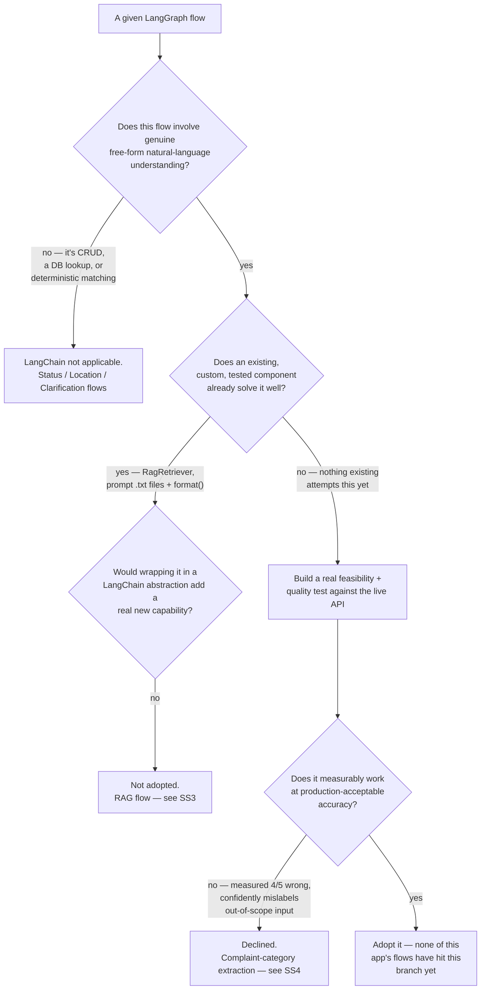

# LangChain — Where It's Used, Where It Isn't, and Why

*Written for someone who wants to actually understand this, not just skim it — including "why did you build it this way" answers you could give in an interview.*

> Part of the JanSarthi AI documentation set. See [`README.md`](../README.md) for the full index of every document. This doc pulls together and expands on the LangChain-specific evaluation already recorded in [`docs/ask_sarthi_service_flow.md`](ask_sarthi_service_flow.md) §2–4 — that doc covers the full service-flow phase; this one is just the LangChain question, in depth, on its own.

---

## 1. LangChain vs. LangGraph — two different things, easy to conflate

**LangGraph** (see [`docs/ask_sarthi_orchestration.md`](ask_sarthi_orchestration.md)) is the
graph/state-machine framework Ask Sarthi's entire conversation flow is built on — 14 real nodes,
conditional-edge routing, one shared response node. This is used extensively and is not optional;
it *is* the orchestration layer.

**LangChain** is a separate, higher-level library of pre-built abstractions on top of an LLM call:
prompt templates, retriever interfaces, structured-output parsing, chains. LangGraph doesn't
require LangChain — you can (and this app does) write graph nodes that call an LLM directly with
plain code. The question this doc answers is **not** "do we use LangGraph" (yes, throughout) but
"do we *also* reach for LangChain's abstractions on top of it" — and the honest, evidence-based
answer, per flow, is mostly no.

## 2. The decision, visually

## 3. RAG flow — evaluated candidate by candidate, none adopted

The RAG flow (retrieval + grounded answer generation, see
[`docs/ask_sarthi_rag_architecture.md`](ask_sarthi_rag_architecture.md)) has five places
LangChain plausibly could have slotted in. Each was evaluated against what already exists, not
dismissed on principle:

| Candidate | Existing approach | Verdict |
|---|---|---|
| Prompt templates | `.txt` files + `str.format()` via `get_prompt()` (`backend/config.py`) — this codebase's established convention, used at every LLM call site | **Not adopted.** LangChain's `PromptTemplate` would wrap the same `.format()` call with no new capability. |
| Retriever interface | `RagRetriever` — category+location metadata filtering, relevance threshold, hybrid BM25 widening, cross-encoder reranking, VERIFIED-preference tie-break, all custom-built and tested | **Not adopted.** Wrapping it in LangChain's `BaseRetriever` risks obscuring the custom threshold/rerank logic for no functional gain — nothing today needs `RagRetriever` to interoperate with a LangChain chain. |
| Structured output | Not used for RAG answers at all — the answer is free-text prose; citations are built from Chroma metadata directly, **never** from the LLM | **Not applicable by design.** This is the actual mechanism that makes fabricated citations structurally impossible — there is nothing structured to ask the LLM to extract in the first place. |
| Context formatting | `"\n\n---\n\n".join(context_chunks)` | **Not adopted.** Trivial; no abstraction earns its cost here. |
| LLM invocation | `sarvamai` SDK's `client.chat.completions()` directly, inside `AnswerGenerationService` | **Not adopted** — see §4 for the live test that actually informed this. |

**No RAG code changed as a result of this evaluation.** `RagRetriever`, `ChromaVectorStore`,
`SentenceTransformerEmbeddingProvider`, and `AnswerGenerationService` remain byte-for-byte what
they were before LangChain was ever considered here.

## 4. Complaint flow — the one candidate actually load-tested against the live API

The one place LangChain was evaluated with more than a desk review: using an LLM
(`langchain_openai.ChatOpenAI` pointed at Sarvam's OpenAI-compatible endpoint, via
`.with_structured_output(...)`) to extract `{category, issue, location, description}` from a
citizen's raw complaint text, as a possible complement to the existing keyword classifier.

**Mechanism check** — it works. Sarvam's REST API is genuinely OpenAI-request-shape-compatible
(confirmed by reading the `sarvamai` SDK's own request construction), so
`ChatOpenAI(base_url="https://api.sarvam.ai/v1", ..., model="sarvam-105b")` connects and returns
real, schema-validated Pydantic objects.

**Quality check — the part that actually matters.** Two live runs, 5 short complaint-style
sentences each, classifying into a 4-option `Literal[...]` field (or `null`), with the options
listed in a *different order* each run specifically to rule out simple list-position bias as the
explanation for any error:

| Input | Expected | Run 1 | Run 2 (options reordered) |
|---|---|---|---|
| "The bin outside my flat hasn't been emptied in a week" | WASTE_SANITATION | WATER_DRAINAGE ✗ | WATER_DRAINAGE ✗ (low confidence) |
| "There's a big crater in the road outside my building" | ROADS_POTHOLES | STREETLIGHTS ✗ | ROADS_POTHOLES ✓ |
| "I want to book a train ticket" | *null* (out of scope) | STREETLIGHTS ✗ (**high** confidence) | STREETLIGHTS ✗ (**high** confidence) |
| "The pole light near the bus stop stopped glowing at night" | STREETLIGHTS | STREETLIGHTS ✓ | ROADS_POTHOLES ✗ (high confidence) |
| "Sewage is backing up into my kitchen sink" | WATER_DRAINAGE | STREETLIGHTS ✗ | STREETLIGHTS ✗ (medium confidence) |

**4 of 5 wrong, in both runs, with different specific errors each time** — ruling out a pure
positional-bias explanation; this is broader unreliability. The single most damning result: the one
genuinely out-of-scope input ("book a train ticket") was assigned a real civic category with **high
self-reported confidence**, in both runs, instead of correctly returning `null`.

**Why that specific failure mode matters more than the raw 80% error rate:** this classification
feeds directly into which municipal department/worker queue a complaint gets routed to. A
*confidently wrong* answer is a worse failure mode for that purpose than the existing keyword
classifier's honest "no category matched — ask the citizen a clarifying question" behavior.
Precision matters more than recall here, and this integration measurably delivered neither.

**Decision: declined**, based on that evidence, not on principle. `complaint_flow_node`'s category
resolution stays 100% the existing deterministic path: current-message keyword classification →
conversation-history recovery → clarification if still unknown. No LLM output ever reaches
complaint routing. `langchain-openai` — installed locally only for this evaluation — was
deliberately **not** added to `requirements.txt`; it ships in zero production code paths.

This is reported as a genuine, first-class result of the evaluation, not an incomplete task — a
rigorous, evidence-based "no, and here's the measured reason" is exactly the right outcome when a
spec asks "evaluate whether LangChain provides useful abstractions here" and the live evidence says
it doesn't yet, for this specific use.

## 5. Status / Location / Clarification flows — LangChain intentionally never considered a fit

- **Status lookup** is a plain, deterministic database query (via the repository layer — see
  [`docs/ask_sarthi_service_flow.md`](ask_sarthi_service_flow.md) §6).
- **Location resolution** is deterministic gazetteer/hierarchy matching — no distance or geocoding
  calculation an LLM should ever be trusted to compute.
- **Clarification** is plain state-driven templated text, not free-form generation.

None of these involve the kind of free-form natural-language *understanding* an LLM adds real
value over what exact-match/regex/DB lookups already do — correctly, deterministically, and fast.

## 6. The general rule this evaluation actually established

Not "avoid LangChain" and not "add LangChain everywhere it could technically fit" — the rule that
falls out of §§3–5, worth stating explicitly in an interview: **reach for an LLM abstraction only
where the task genuinely requires free-form language understanding a deterministic approach can't
do at all, and only after checking whether an existing, already-tested custom component already
solves it — then verify with a real, measured test before trusting it with something a citizen's
complaint routing depends on.** Every "not adopted" verdict above followed exactly that rule, not
a blanket anti-dependency stance — this is why `langgraph` itself (a much larger dependency) is
used extensively while `langchain-openai` isn't used at all.

## 7. Likely interview questions about this part of the project

**"Do you use LangChain?"** — LangGraph (the orchestration graph itself) extensively, yes.
LangChain's higher-level abstractions (prompt templates, retriever wrappers, structured-output
extraction) — evaluated candidate by candidate, and not adopted anywhere in production, based on
evidence rather than avoidance. See §§3–4.

**"Why not use LangChain's retriever interface for your RAG pipeline?"** — `RagRetriever` already
has custom, tested logic (hybrid search, threshold filtering, cross-encoder reranking, a
VERIFIED-preference tie-break) that a generic `BaseRetriever` wrapper wouldn't add capability to,
and risks obscuring. See §3.

**"Tell me about a time you tried something and it didn't work out."** — the complaint-category
LLM-extraction test in §4 is a genuine, well-documented example: real feasibility check, real live
quality test, real measured 80% error rate including a dangerous false-positive on out-of-scope
input, and a decision to decline based on that evidence rather than sunk-cost adopting it anyway.

**"How do citations never get fabricated in your RAG answers?"** — structurally, not just by
prompting: the LLM never produces structured output for citations at all; they're built directly
from Chroma's own metadata on the retrieved chunks. See §3's "Structured output" row.

---

*Related reading: [`docs/ask_sarthi_service_flow.md`](ask_sarthi_service_flow.md),
[`docs/ask_sarthi_orchestration.md`](ask_sarthi_orchestration.md),
[`docs/ask_sarthi_rag_architecture.md`](ask_sarthi_rag_architecture.md).*
